# DVFL-Net: A Lightweight Distilled Video Focal Modulation Network for Spatio-Temporal Action Recognition

[Hayat Ullah](https://scholar.google.com.pk/citations?user=xnXPj0UAAAAJ&hl=en),
[Muhammad Ali Shafique](https://scholar.google.com.pk/citations?user=TppbarkAAAAJ&hl=en&oi=ao),
[Abbas Khan](https://scholar.google.com.pk/citations?user=k-HJxNAAAAAJ&hl=en),
[Arslan Munir](https://scholar.google.com.pk/citations?user=-P9waaQAAAAJ&hl=en)

<!-- [](https://arxiv.org/abs/2307.06947) -->

<hr />

> **Abstract:**
>*The landscape of video recognition has undergone a significant transformation, shifting from traditional Convolutional Neural Networks (CNNs) to Transformer-based architectures in order to achieve better accuracy. While CNNs, especially 3D variants, have excelled in capturing spatiotemporal dynamics for action recognition, recent developments in Transformer models, with their self-attention mechanisms, have proven highly effective in modeling long-range dependencies across space and time. Despite their state-of-the-art performance on prominent video recognition benchmarks, the computational demands of Transformers, particularly in processing dense video data, remain a significant hurdle. To address these challenges, we introduce a lightweight Video Focal Modulation Network named DVFL-Net, which distills the spatio-temporal knowledge from large pre-trained teacher to nano student model, making it well-suited for on-device applications. By leveraging knowledge distillation and spatial-temporal feature extraction, our model significantly reduces computational overhead (approximately 7$\times$) while maintaining high performance in video recognition tasks. We combine the forward Kullback–Leibler (KL) divergence and spatio-temporal focal modulation to distill the local and global spatio-temporal context from the Video-FocalNet Base (teacher) to our proposed nano VFL-Net (student) model. We extensively evaluate our DVFL-Net, both with and without forward KL divergence, against recent state-of-the-art HAR approaches on UCF50, UCF101, HMDB51, SSV2 and Kinetics-400 datasets. Further, we conducted a detailed ablation study in forward KL divergence settings and report the obtained observations.  The obtained results confirm the superiority of the distilled VFL-Net (i.e., DVFL-Net) over existing methods, highlighting its optimal tradeoff between performance and computational efficiency, including reduced memory usage and lower GFLOPs, making it a highly efficient solution for HAR tasks.*

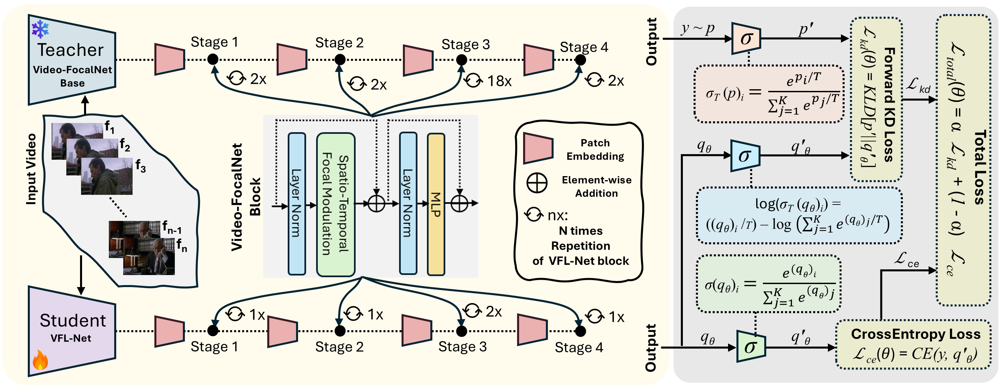
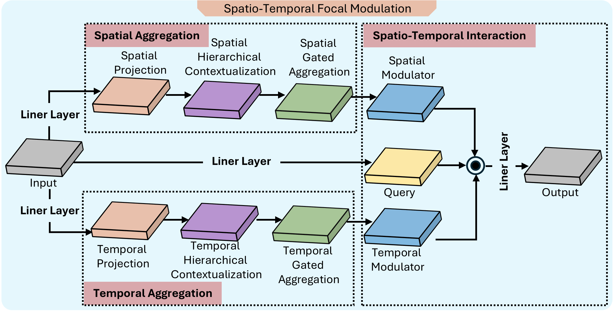

## Environment Setup
Please follow [INSTALL.md](./INSTALL.md) for installation.

## Dataset Preparation
Please follow [DATA.md](./DATA.md) for data preparation.

## Model Zoo

### HMDB51

|       Model      |    Depth   | Dim | Kernels | Top-1 | Top-5 | Parameters | Download |
|:----------------:|:----------:|:---:|:-------:|:-----:|:-----:|:--------:|:--------:|
| Video-FocalNet-B | [2,2,18,2] | 128 |  [3,5]  |  84.2 |  93.6 |  157M |   [ckpt](https://drive.google.com/file/d/1bVZDaOkyAIWK-SKkdV-AE6OrC9Cf0FMl/view?usp=drive_link)   |
| Video-FocalNet-S | [2,2,18,2] |  96 |  [3,5]  |  83.4 |  92.4 |  88M  |   [ckpt](https://drive.google.com/file/d/173gvSJ6ZhjhfTxaXrA9wtFBW3S5p-HC7/view?usp=drive_link)   |
| Video-FocalNet-T |  [2,2,6,2] |  96 |  [3,5]  |  81.5 |  91.1 |  49M  |   [ckpt](https://drive.google.com/file/d/14_MxJra5a9kkQf7obcFgTyfzixdqAnJ-/view?usp=drive_link)   |
| VFL-Net          |  [1,1,2,1] |  96 |  [3,5]  |  71.6 |  88.5 |  22M  |   [ckpt](https://drive.google.com/file/d/11EsoZx2hkKG8zqa62dpbcaPXnlwjpvNU/view?usp=drive_link)   |
| DVFL-Net         |  [1,1,2,1] |  96 |  [3,5]  |  82.7 |  92.8 |  22M  |   [ckpt](https://drive.google.com/file/d/1S9MuvG2Snhq4cvN0YLTEEmqUVUs07Ves/view?usp=drive_link)   |

### UCF50

|       Model      |    Depth   | Dim | Kernels | Top-1 | Top-5 | Parameters | Download |
|:----------------:|:----------:|:---:|:-------:|:-----:|:-----:|:--------:|:--------:|
| Video-FocalNet-B | [2,2,18,2] | 128 |  [3,5]  |  91.1 |  98.7 |  157M |   [ckpt](https://drive.google.com/file/d/1mN3N1h3v6JlaqCEXizccx9lXzkcjc34x/view?usp=drive_link)   |
| Video-FocalNet-S | [2,2,18,2] |  96 |  [3,5]  |  90.8 |  97.9 |  88M  |   [ckpt](https://drive.google.com/file/d/1Z0P1TwtCXxw8B0BqAYSgZqRxO6eLac6i/view?usp=drive_link)   |
| Video-FocalNet-T |  [2,2,6,2] |  96 |  [3,5]  |  90.1 |  97.1 |  49M  |   [ckpt](https://drive.google.com/file/d/1jqmLbrYBwuJ8p8xWac0QLXaVh3EuurGj/view?usp=drive_link)   |
| VFL-Net          |  [1,1,2,1] |  96 |  [3,5]  |  81.4 |  91.4 |  22M  |   [ckpt](https://drive.google.com/file/d/1ObieSNBKb7LU_towZdj-pGH4hl2DduPI/view?usp=drive_link)   |
| DVFL-Net         |  [1,1,2,1] |  96 |  [3,5]  |  86.6 |  95.2 |  22M  |   [ckpt](https://drive.google.com/file/d/1OojbPcDJjyRHqjVDW6IO038_imRlHqCm/view?usp=drive_link)   |

### UCF101

|       Model      |    Depth   | Dim | Kernels | Top-1 | Top-5 | Parameters | Download |
|:----------------:|:----------:|:---:|:-------:|:-----:|:-----:|:--------:|:--------:|
| Video-FocalNet-B | [2,2,18,2] | 128 |  [3,5]  |  91.9 |  99.4 |  157M |   [ckpt](https://drive.google.com/file/d/1lyu15Ltj8WSGTQVKnw3B88T4nC_0jOwv/view?usp=drive_link)   |
| Video-FocalNet-S | [2,2,18,2] |  96 |  [3,5]  |  91.2 |  98.9 |  88M  |   [ckpt](https://drive.google.com/file/d/1ccZ65CxmBDDbExeQ_oaYwlfDzSBfnFor/view?usp=drive_link)   |
| Video-FocalNet-T |  [2,2,6,2] |  96 |  [3,5]  |  90.7 |  98.4 |  49M  |   [ckpt](https://drive.google.com/file/d/1BFVY7wCyMve77HKvoCAiathIuiIEpPQ3/view?usp=drive_link)   |
| VFL-Net          |  [1,1,2,1] |  96 |  [3,5]  |  82.5 |  93.7 |  22M  |   [ckpt](https://drive.google.com/file/d/1GA_lzpBcm2LT9shywfCdrPO8Rs61JOyw/view?usp=drive_link)   |
| DVFL-Net         |  [1,1,2,1] |  96 |  [3,5]  |  88.4 |  96.1 |  22M  |   [ckpt](https://drive.google.com/file/d/10bf0RcmfftRTLeY5TvgstKwQt_OG9FMY/view?usp=drive_link)   |

## Training (Teacher Pretraining)
To train teacher model on a given dataset, run the following:
```bash
torchrun --nproc_per_node <num-of-gpus-to-use>  main.py --cfg <config-file> --output <output-directory> --opts DATA.NUM_Frames <number of frames> 
```
- ``` --nproc_per_node ```: set the number of GPU devices, in our case we used 3 GPUs.
- ``` --cfg ```: the path of config file (located in configs directory), containing the model, data, and training configurations.
- ``` --output ```: the path of output directory that will contain the training history (incluing both model weights and training logs).
- ``` --opts ```: it allow user to provide additional data related (i.e., ``` DATA.NUM_Frames ```) or training related (i.e., ``` TRAIN.EPOCHS ```).
  
For instance, to train the teacher model (pretraining) using 3 GPUs on the UCF101 dataset, run the following command:
```bash
torchrun --nproc_per_node 3 main.py --cfg configs/ucf101/video-focalnet_base.yaml --output output/ --opts DATA.NUM_FRAMES 8
```
**Note:** During pretraining, we intialized our teacher model with the ImageNet-1K weights of [FocalNets](https://github.com/microsoft/FocalNet) model. To initialize a model with pretrained weights, set ```TRAIN.PRETRAINED_PATH``` to the path of the pretrained model weights. This can be configured either in the configuration file (located in the ```configs``` directory) or directly in the bash script. Alternatively, to train the model from scratch, simply leave ```TRAIN.PRETRAINED_PATH``` empty.

Alternatively, the above step can be done by simply running the ``` bash.sh ``` file located in scripts directory. For instance:
```bash
bash scripts/ucf101/video-focalnet_base.sh
```

## Training (Knowledge Distillation) 
To train the student model in knowledge distillation settings (under the supervision of pretrained teacher model) on a given dataset, run the following:
```bash
torchrun --nproc_per_node <num-of-gpus-to-use> main_KD.py --cfg <config-file> --output <output-directory> --opts DATA.NUM_Frames <number of frames> KD.ALPHA <alpha value> KD.BETA <beta value> KD.GAMMA <gamma value> KD.TEMPERATURE <temperature value>
```
- ``` --nproc_per_node ```: set the number of GPU devices, in our case we used 3 GPUs.
- ``` --cfg ```: the path of config file (located in configs directory), containing the model, data, and training configurations.
- ``` --output ```: the path of output directory that will contain the training history (incluing both model weights and training logs).
- ``` --opts ```: it allow user to provide additional data related (i.e., ``` DATA.NUM_Frames ```), training related (i.e., ``` TRAIN.EPOCHS ```), and knowledge distillation related (i.e., ``` KD.ALPHA ```, ``` KD.BETA ```, ``` KD.GAMMA ```, and ``` KD.TEMPERATURE ```).

For instance, to train the student model (VFL-Net) in knowledge settings under the supervision of teacher model (video-focalnet_base) using 3 GPUs on the UCF101 dataset, run the following command:
```bash
torchrun --nproc_per_node 3 main_KD.py --cfg configs/ucf101/VFL-Net_kd.yaml --output output/ --opts DATA.NUM_FRAMES 8 KD.ALPHA 0.2 KD.BETA 0.3 KD.GAMMA 0.5 KD.TEMPERATURE 10
```
Alternatively, the above step can be done by simply running the ``` bash.sh ``` file located in scripts directory. For instance:
```bash
bash scripts/ucf101/VFL-Net_kd.sh
```

## Evaluation
To evaluate the performance of pretrained model on a test set of given dataset, run the following:
```bash
torchrun --nproc_per_node <num-of-gpus-to-use> main.py --eval --cfg <config-file> --resume <checkpoint> TEST.NUM_CLIP <number of clips> TEST.NUM_CROP <number of crops>
```
- ``` --nproc_per_node ```: set the number of GPU devices, in our case we used 3 GPUs.
- ``` --eval ```: it set the model mode to evaluation and avoid trianing.
- ``` --cfg ```: the path of config file (located in configs directory), containing the model, data, and training configurations.
- ``` --resume ```: the of pretrained weights.
- ``` --opts ```: it allow user to provide additional data related (i.e., ``` DATA.NUM_Frames ```) or test related (i.e., ``` TEST.NUM_CLIP ``` and ``` TEST.NUM_CROP ```).

For instance, to evaluate the student model trained in knowledge distillation settings using 1 GPU1 on the test set of UCF101 dataset, run the following command:
```bash
torchrun --nproc_per_node 1 main.py --eval --cfg configs/ucf101/VFL-Net.yaml --resume output/ucf101/VFL-Net/LR_0.1_EP_120_OPT_sgd_FRAMES_8/ckpt_epoch_119.pth TEST.NUM_CLIP 4 TEST.NUM_CROP 3
```

## Getting FLOPs
```
python get_flops.py --cfg <provide the path of configuration file of your model>
```

## Visualization (Spatio-Temporal Focal Modulation)

&nbsp;&nbsp;&nbsp;&nbsp;&nbsp;&nbsp;&nbsp;&nbsp;&nbsp;&nbsp;&nbsp;&nbsp; **Input Video** &nbsp;&nbsp;&nbsp;&nbsp;&nbsp;&nbsp;&nbsp;&nbsp;&nbsp;&nbsp;&nbsp;&nbsp;&nbsp;&nbsp;&nbsp;&nbsp;&nbsp;&nbsp;&nbsp;&nbsp;&nbsp;&nbsp;&nbsp;&nbsp;&nbsp;&nbsp; **First Layer** &nbsp;&nbsp;&nbsp;&nbsp;&nbsp;&nbsp;&nbsp;&nbsp;&nbsp;&nbsp;&nbsp;&nbsp;&nbsp;&nbsp;&nbsp;&nbsp;&nbsp;&nbsp;&nbsp;&nbsp;&nbsp;&nbsp;&nbsp;&nbsp;&nbsp; **Second Layer** &nbsp;&nbsp;&nbsp;&nbsp;&nbsp;&nbsp;&nbsp;&nbsp;&nbsp;&nbsp;&nbsp;&nbsp;&nbsp;&nbsp;&nbsp;&nbsp;&nbsp;&nbsp;&nbsp;&nbsp;&nbsp;&nbsp;&nbsp;&nbsp; **Third Layer** &nbsp;&nbsp;&nbsp;&nbsp;&nbsp;&nbsp;&nbsp;&nbsp;&nbsp;&nbsp;&nbsp;&nbsp;&nbsp;&nbsp;&nbsp;&nbsp;&nbsp;&nbsp;&nbsp;&nbsp;&nbsp;&nbsp;&nbsp;&nbsp; **Fourth Layer**
<div style="display: flex; justify-content: space-between;">
    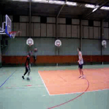
    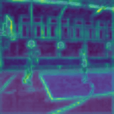
    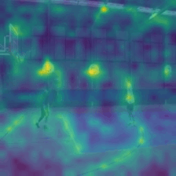
    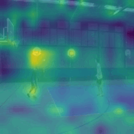
    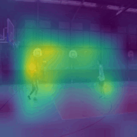
</div>
<div style="display: flex; justify-content: space-between;">
    
    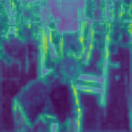
    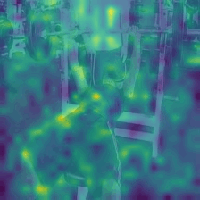
    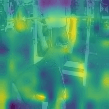
    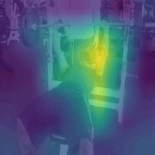
</div>
<div style="display: flex; justify-content: space-between;">
    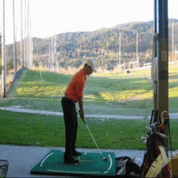
    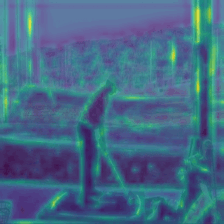
    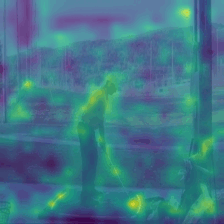
    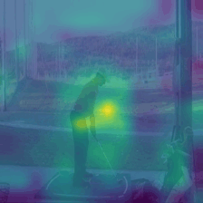
    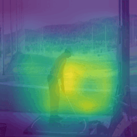
</div>
<div style="display: flex; justify-content: space-between;">
    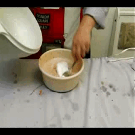
    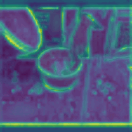
    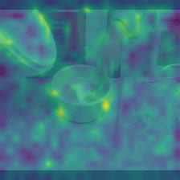
    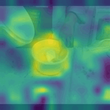
    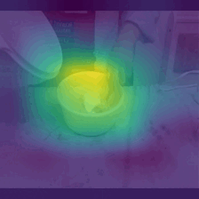
</div>
<div style="display: flex; justify-content: space-between;">
    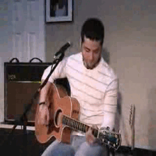
    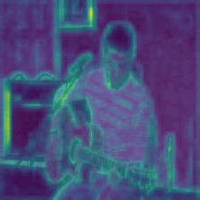
    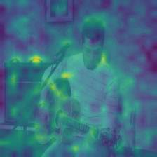
    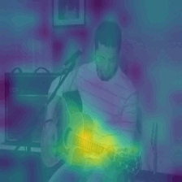
    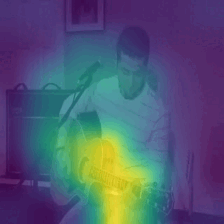
</div>
<div style="display: flex; justify-content: space-between;">
    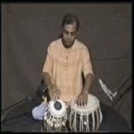
    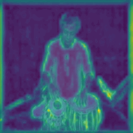
    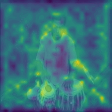
    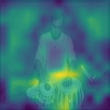
    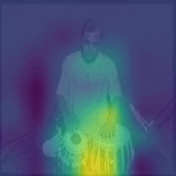
</div>
<div style="display: flex; justify-content: space-between;">
    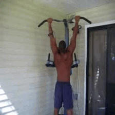
    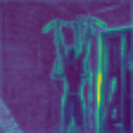
    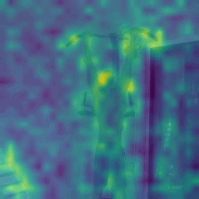
    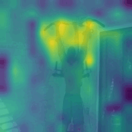
    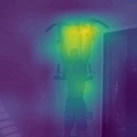
</div>
<div style="display: flex; justify-content: space-between;">
    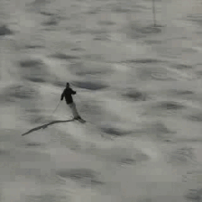
    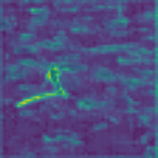
    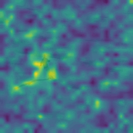
    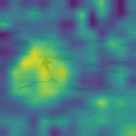
    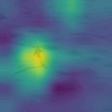
</div>


<!--
## Citation
If you find our work, this repository, or pretrained models useful, please consider giving a star :star: and citation.
```bibtex
@InProceedings{Wasim_2023_ICCV,
    author    = {Wasim, Syed Talal and Khattak, Muhammad Uzair and Naseer, Muzammal and Khan, Salman and Shah, Mubarak and Khan, Fahad Shahbaz},
    title     = {Video-FocalNets: Spatio-Temporal Focal Modulation for Video Action Recognition},
    booktitle = {Proceedings of the IEEE/CVF International Conference on Computer Vision (ICCV)},
    year      = {2023},
}
``` 
-->

## Contact
For any questions or inquiries, please open an issue in this repository or contact us at hullah2024@fau.edu. 

## Acknowledgements
We acknowledge that our work is inspired by the [FocalNets](https://github.com/microsoft/FocalNet) and [Video-FocalNets](https://github.com/TalalWasim/Video-FocalNets) repositories. We sincerely thank the authors for making their code publicly available.
<!-- If you use our model, please consider citing these works as well. -->
