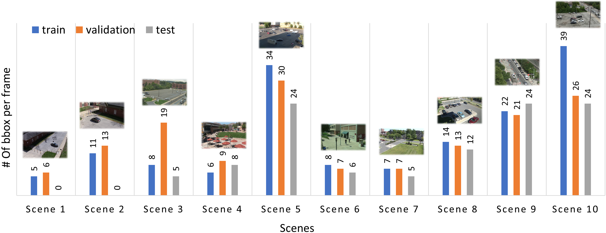

# OD-VIRAT Dataset
The proposed **OD-VIRAT** dataset is the object detection variant of [VIRAT Ground 2.0 dataset](https://viratdata.org/). Originally, VIRAT Ground 2.0 dataset is developed for continuous visual event recognition tasks, comprising 329 surveillance videos captured through stationary ground cameras mounted at significant heights (mostly at the top of buildings) across 11 different scenes. The recorded scenes include construction sites, parking lots, streets, and open outdoor areas. The authors of VIRAT Ground 2.0 dataset used different models of HD video cameras to capture scenes at different resolutions (1920$\times$1080 and 1280$\times$720) and frame rates range (25$\thicksim$30 FPS).

## OD-VIRAT Large

## OD-VIRAT Tiny

## OD-VIRAT Scenes
<table>
  <tr>
    <td>

</td>
    <td>

</td>
  </tr>
  <tr>
  <td>
<b>Scene 1</b></td>
  <td>
<b>Scene 2</b></td>
  </tr>
  <tr>
    <td>

</td>
    <td>

</td>
  </tr>
  <tr>
  <td>
<b>Scene 3</b></td>
  <td>
<b>Scene 4</b></td>
  </tr>
  <tr>
    <td>

</td>
    <td>

</td>
  </tr>
  <tr>
  <td>
<b>Scene 5</b></td>
  <td>
<b>Scene 6</b></td>
  </tr>
  <tr>
    <td>

</td>
    <td>

</td>
  </tr>
  <tr>
  <td>
<b>Scene 7</b></td>
  <td>
<b>Scene 8</b></td>
  </tr>
  <tr>
    <td>

</td>
    <td>

</td>
  </tr>
  <tr>
  <td>
<b>Scene 9</b></td>
  <td>
<b>Scene 10</b></td>
  </tr>
</table>

> Data distribution across 10 scenes in train, validation, and test sets of **OD-Virat Large** dataset.

Scenes       | Train           | Validation     | Test           |
-------------|-----------------|----------------|----------------|
Scene 1      | ███ 5%          | ████ 7%        | 0%             |
Scene 2      | ███ 5%          | ██████████ 21% | 0%             |
Scene 3      | ██ 4%           | ████ 8%        | ███ 5%         | 
Scene 4      | ██████ 12%      | █████ 9%       | ██████████ 21% |
Scene 5      | ███████ 13%     | ███ 5%         | █████ 9%       | 
Scene 6      | ████████ 15%    | ██████ 12%     | █████████ 17%  | 
Scene 7      | ███████████ 27% | █████████ 18%  | ████████ 15%   |
Scene 8      | ████ 6%         | ████████ 16%   | ████████ 15%   | 
Scene 9      | ███ 5%          | ██ 3%          | ██ 4%          | 
Scene 10     | █████ 8%        | █ 1%           | ████████ 14%   |

> Data distribution across 10 scenes in train, validation, and test sets of **OD-Virat Tiny** dataset.

Scenes       | Train           | Validation     | Test           |
-------------|-----------------|----------------|----------------|
Scene 1      | ████ 6%         | ████ 7%        | 0%             |
Scene 2      | ███ 5%          | ██████████ 22% | 0%             |
Scene 3      | ██ 4%           | ████ 8%        | ███ 5%         | 
Scene 4      | ██████ 12%      | █████ 9%       | ██████████ 21% |
Scene 5      | ███████ 13%     | ███ 5%         | █████ 9%       | 
Scene 6      | ████████ 15%    | ██████ 12%     | █████████ 17%  | 
Scene 7      | ███████████ 27% | █████████ 18%  | ████████ 15%   |
Scene 8      | ████ 6%         | ████████ 16%   | ████████ 15%   | 
Scene 9      | ███ 5%          | ██ 3%          | ██ 4%          | 
Scene 10     | █████ 8%        | █ 1%           | ████████ 14%   |

