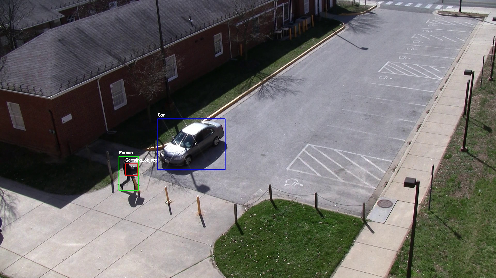
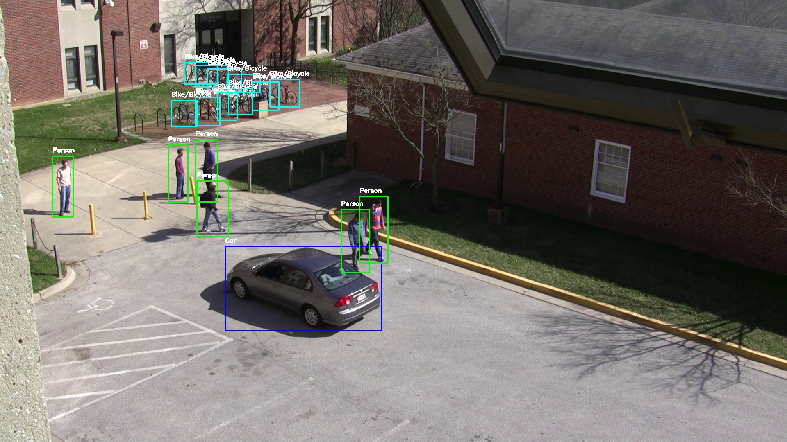
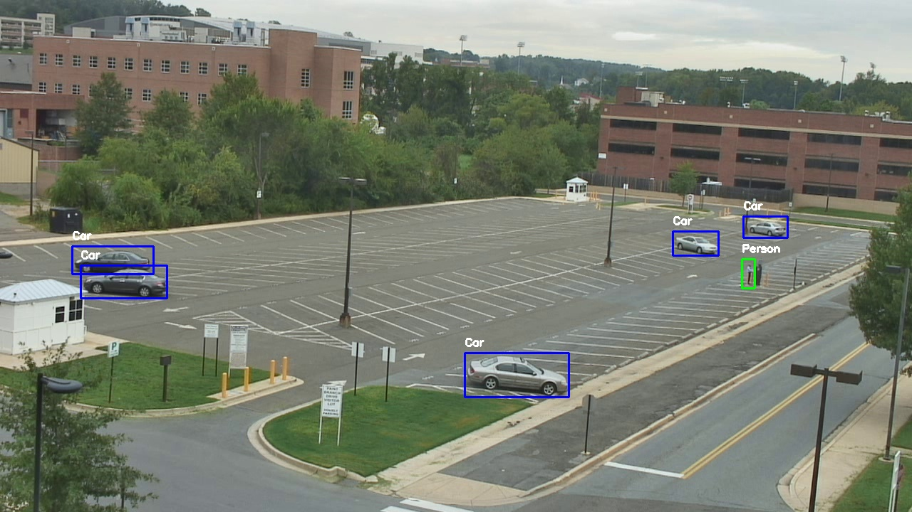
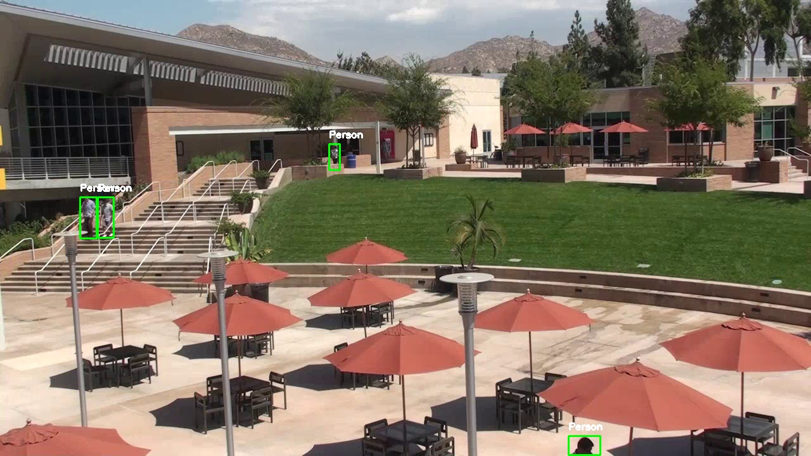
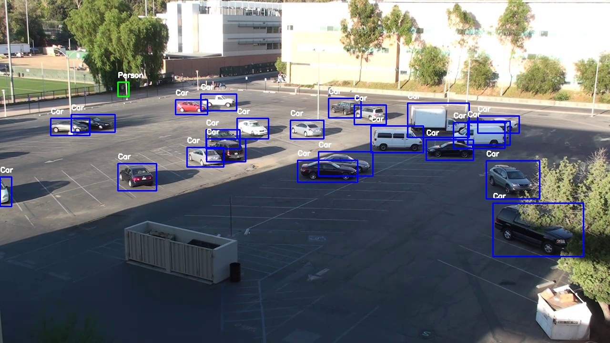
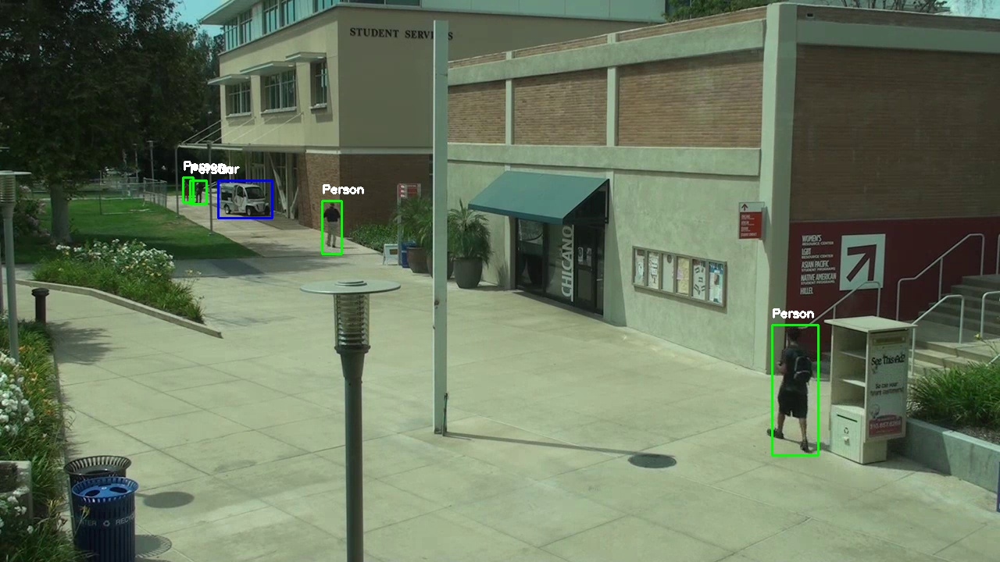
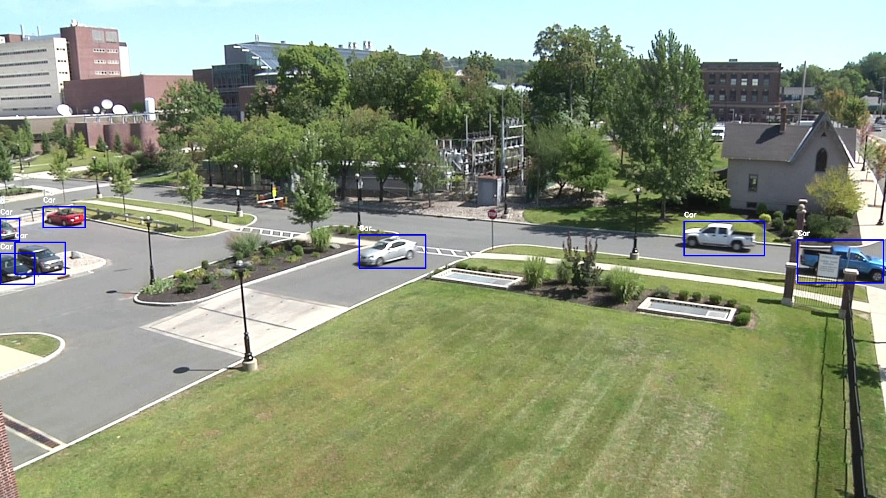
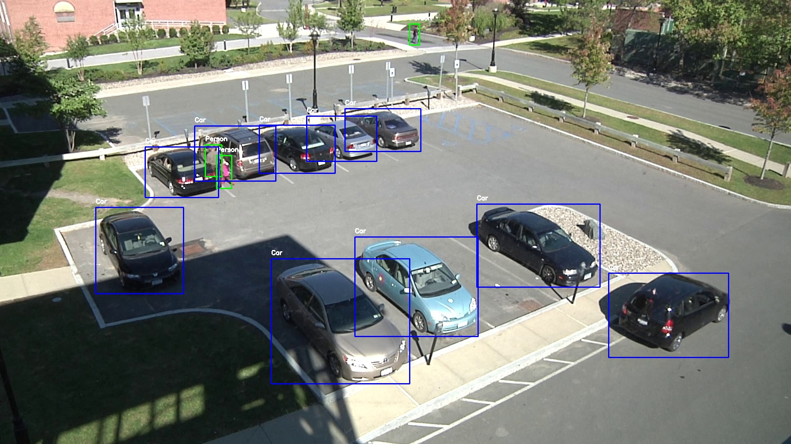
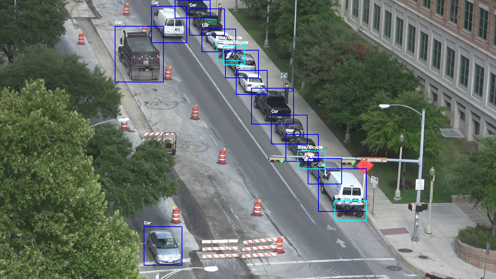
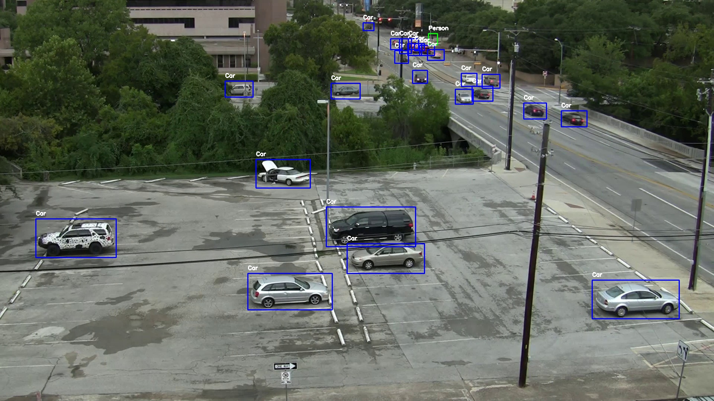

<p align="center">
  
</p> 

# OD-VIRAT: A Large-Scale Benchmark for Object Detection in Realistic Surveillance Environments
[Hayat Ullah](https://scholar.google.com.pk/citations?user=xnXPj0UAAAAJ&hl=en),
[Abbas Khan](https://scholar.google.com.pk/citations?user=k-HJxNAAAAAJ&hl=en&oi=sra),
[Arslan Munir](https://scholar.google.com.pk/citations?user=-P9waaQAAAAJ&hl=en)


[]() [**Under Review**]
<hr />

> **Abstract:**
>Realistic human surveillance datasets are crucial for training and evaluating computer vision models under real-world conditions, facilitating the development of robust algorithms for human and human-interacting object detection in complex environments. These datasets need to offer diverse and challenging data to enable a comprehensive assessment of model performance and the creation of more reliable surveillance systems for public safety. To this end, we present two visual object detection benchmarks named OD-VIRAT Large and OD-VIRAT Tiny, aiming at advancing visual understanding tasks in surveillance imagery. The video sequences in both benchmarks cover 10 different scenes of human surveillance recorded from significant height and distance. The proposed benchmarks offer rich annotations of bounding boxes and categories, where OD-VIRAT Large has 8.7 million annotated instances in 599,996 images and OD-VIRAT Tiny has 288,901 annotated instances in 19,860 images. This work also focuses on benchmarking state-of-the-art object detection architectures, including RETMDET, YOLOX, RetinaNet, DETR, and Deformable-DETR on this object detection-specific variant of VIRAT dataset. To the best of our knowledge, it is the first work to examine the performance of these recently published state-of-the-art object detection architectures on realistic surveillance imagery under challenging conditions such as complex backgrounds, occluded objects, and small-scale objects. The proposed benchmarking and experimental settings will help in providing insights concerning the performance of selected object detection models and set the base for developing more efficient and robust object detection architectures.

## Table of Contents
<!--ts-->
  <!-- * [News](#rocket-News) -->
   * [Visualization](#visualization-visual-illustration-of-each-scene)
   * [Environment Setup](#environment-setup)
   * [Dataset Detail and Data Preparation](#dataset-detail-and-data-preparation)
   * [Training](#training)
   * [Evaluation](#evaluation)
   * [Citation](#citation)
   * [Acknowledgements](#acknowledgements)
<!--te-->

<!-- ## News -->

## Visualization: Visual Illustration of Each Scene 

<!-- First row of images -->
<div style="display: flex; justify-content: space-around;">
  
  
  
  
  
</div>

<!-- Second row of images -->
<div style="display: flex; justify-content: space-around; margin-top: 50px;">
  
  
  
  
  
</div>

<!--
<p align="center">
  
</p>

<p align="center">
  
</p>

<p align="center">
  
</p>

<p align="center">
  
</p>
-->

## Environment Setup
Please follow [INSTALL.md](./INSTALL.md) for preparing the environement and installation of prerequisite packages.

## Dataset Detail and Data Preparation

Please follow [DATA.md](./DATA.md) for dataset details and data preparation.

## Training
To train a specific model on the OD-VIRAT Tiny dataset, run the following command:
```bash
sbatch --mem=30G --time=40:00:00 --gres=gpu:1 --nodes=1 trainer.sh config
```
- ```sbatch```: Submits the job to the SLURM scheduler.
- ```--mem=30G```: Requests 30 GB of memory for the job.
- ```--time=40:00:00```: Sets a maximum job run time of 40 hours.
- ```--gres=gpu:1```: Requests 1 GPU for the job, one can increase the number of GPU (2 or more) based on their computational and memory requirements.
- ```--nodes=1```: Allocates 1 node for the job.
- ```trainer.sh config```: Runs the ```trainer.sh``` script with ```config``` as an argument.
  
**Or**

```bash
--launcher slurm --mem=30G --time=40:00:00 --gres=gpu:1 --nodes=1 trainer.sh config
```
- ```--launcher```: Provide the job scheduler (i.e., ```pytorch```, ```slurm```, and ```mpi```). In our case, we used ```slurm``` for job sumission.
- ```--mem=30G```: Requests 30 GB of memory for the job.
- ```--time=40:00:00```: Sets a maximum job run time of 40 hours.
- ```--gres=gpu:1```: Requests 1 GPU for the job, one can increase the number of GPU (2 or more) based on their computational and memory requirements.
- ```--nodes=1```: Allocates 1 node for the job.
- ```trainer.sh config```: Runs the ```trainer.sh``` script with ```config``` as an argument.

For example, to train the ```Deformable-Detr``` with ResNet50 backbone on ```OD-VIRAT Tiny``` using single ```GPU```, run the following command:

```bash
sbatch --mem=30G --time=40:00:00 --gres=gpu:1 --nodes=1 trainer.sh configs/deformable_detr/deformable-detr-refine-twostage_r50_16xb2-50e_coco_virat_bs64.py
```
- ```configs/deformable_detr/deformable-detr-refine-twostage_r50_16xb2-50e_coco_virat_bs64.py```: the python file containing the model-specificaiton, data loaders, and training protocols. For instance, in this case the model set to be trained is Deformable Detr (two-stage refinement variant) with ResNet50 backbone with batch size 64 for 50 epochs on OD-VIRAT Tiny dataset.
- ```trainer.sh```: is a bash file that takes ```configs/deformable_detr/deformable-detr-refine-twostage_r50_16xb2-50e_coco_virat_bs64.py``` as an input argument and pass it to ```tools/train.py``` file, as follows:
```
#!/bin/bash
echo $config 

eval "$(conda shell.bash hook)" # Initialize the shell to use Conda
conda info --envs               # list all conda envs available
conda activate 'env_name'

time python tools/train.py $config
```
The ```$config``` contains ```deformable-detr-refine-twostage_r50_16xb2-50e_coco_virat_bs64.py``` which serves as an input argument to ```tools/train.py``` file.

## Evaluation
To test/evaluate a pre-trained model on the test set of OD-VIRAT Tiny dataset, run the following command:
```bash
sbatch --mem=30G --time=01:00:00 --gres=gpu:1 --nodes=1 eval.sh config
```
The rest of the arugments are same except ```eval.sh```, taking ```config``` (containing model evaluation configurations) as an input argument. The ```eval.sh``` evaluate the model using the configurations given in the input configuration file (i.e., evaluation protocols, path to test data, evaluation metrics, and the checkpoints of the pre-trained model.)
For example, to evaluate the pre-trained Deformable Detr (two-stage refinement variant) on the test set of OD-VIRAT Tiny dataset, run the following command:
```
sbatch --mem=30G --time=01:00:00 --gres=gpu:1 --nodes=1 eval.sh configs/deformable_detr/deformable-detr-refine-twostage_r50_16xb2-50e_coco_virat_bs64_eval.py
```
The ```deformable-detr-refine-twostage_r50_16xb2-50e_coco_virat_bs64_eval.py``` provides the configuration as mentioned above for the evaluation of ```deformable-detr-refine-twostage_r50``` model on OD-VIRAT Tiny dataset, as follows:
```
#!/bin/bash
echo $config 

eval "$(conda shell.bash hook)" # Initialize the shell to use Conda
conda info --envs               # list all conda envs available
conda activate 'env_name'

time python tools/test.py $config
```
The ```$config``` contains ```deformable-detr-refine-twostage_r50_16xb2-50e_coco_virat_bs64_eval.py``` which serves as an input argument to ```tools/test.py``` file.


## Citation
Will be updated upon publication.

<!-- If you find our work, this repository, or pretrained models useful, please consider giving a star :star: and citation.
```bibtex
@InProceedings{Wasim_2023_ICCV,
    author    = {Wasim, Syed Talal and Khattak, Muhammad Uzair and Naseer, Muzammal and Khan, Salman and Shah, Mubarak and Khan, Fahad Shahbaz},
    title     = {Video-FocalNets: Spatio-Temporal Focal Modulation for Video Action Recognition},
    booktitle = {Proceedings of the IEEE/CVF International Conference on Computer Vision (ICCV)},
    year      = {2023},
}
``` -->

## Contact
If you have any questions, feel free to open an issue on this repository or reach out at hullah2024@fau.edu.

## Acknowledgements
Our code is based on [MMDetection](https://github.com/open-mmlab/mmdetection) repositoru. We thank the authors for releasing their code. If you use our code, please consider citing these works as well.
